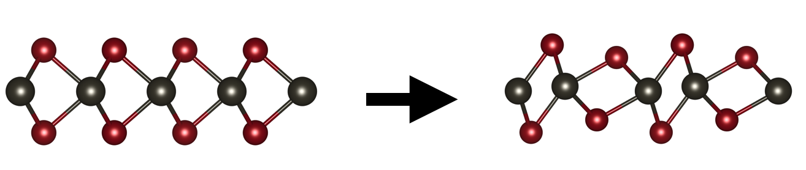

# Low energy consumption phase change memory via electrostatic gating of monolayer MoTe2

This repo contains all data and plotting files needed to generate the
figures found in

- Rehn, D. A., Li, Y., Pop, E. & Reed, E. J. [Theoretical potential for low energy consumption phase change memory utilizing electrostatically-induced structural phase transitions in 2D materials](https://www.nature.com/articles/s41524-017-0059-2). _npj Computational Materials_ **4** (2018).

In this paper, we compute the energy input required to induce a phase
transition via electrostatic gating in monolayer MoTe2. 

We include 3 top-level directories:

- `data`: All input files and scripts related to generating data
  needed for figures.
- `figures`: Scripts used to generate figures in the paper. The
  scripts reference the data in the `data` directory (no data
  is provided in the `figures` folder).
- `table`: Provides a python file for computing values that are found
  in Table 1 of the paper.

