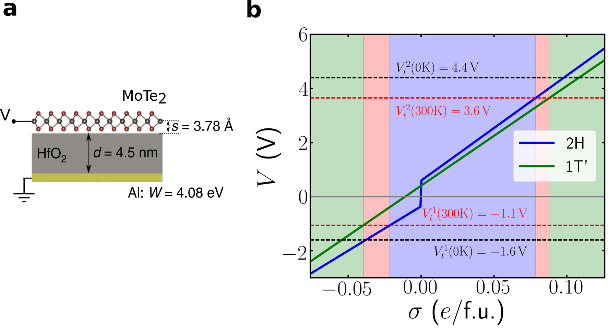
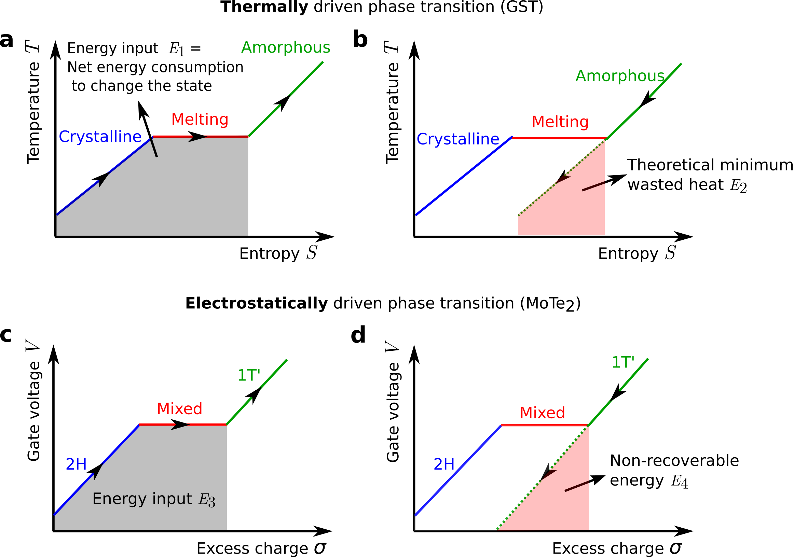
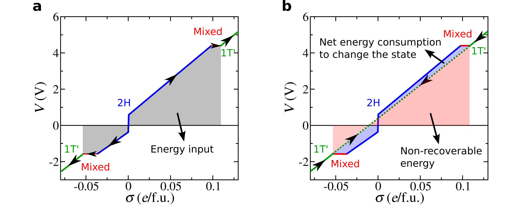
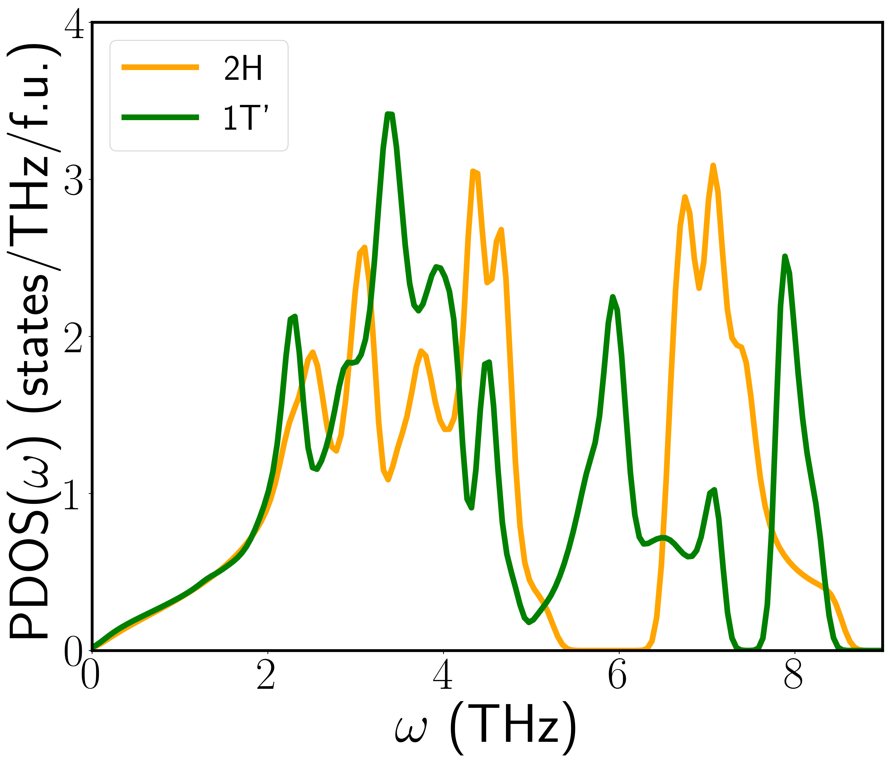
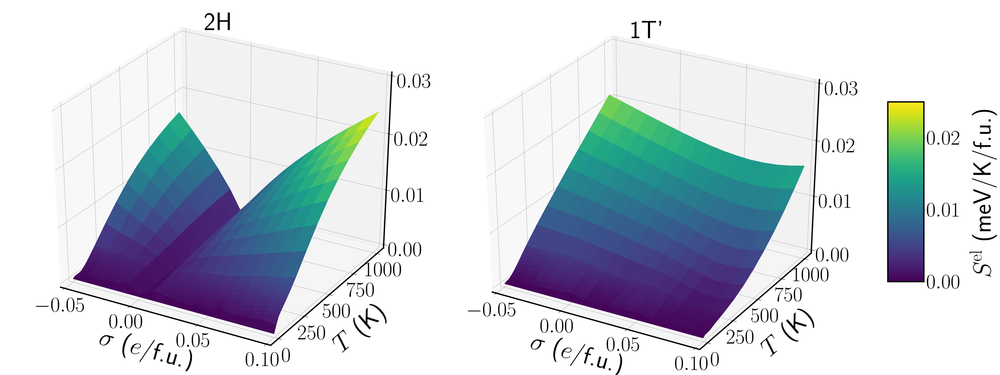
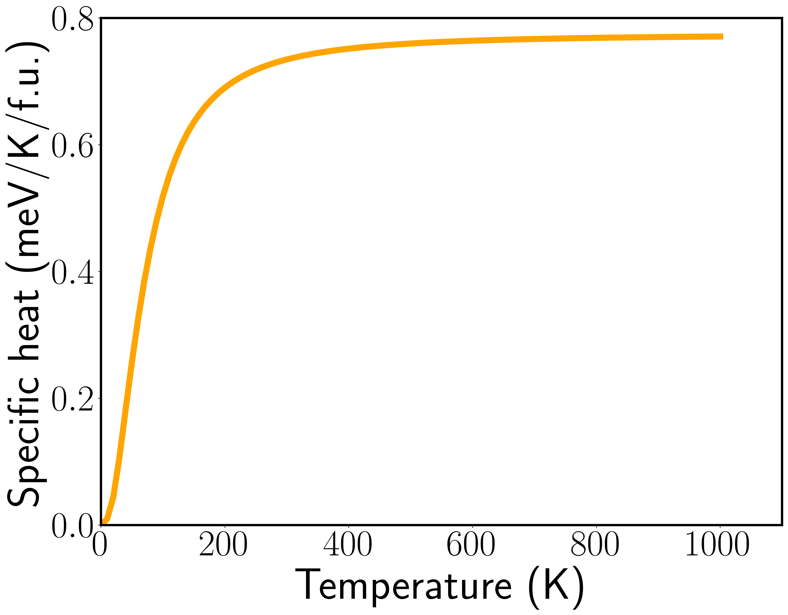

# Figures in the paper and supplementary information

This folder provides all plotting routines to generate the figures in
_Theoretical potential for low energy phase change memory utilizing
electorstatically-induced structural phase transitions in 2D
materials_. Each directory contains Python plotting routines and/or
Inkscape `.svg` files, as well as `pdf` and `png` images. All figures
use data in the folder `../data`. All figures are shown below.

## Figures

### Figure 1

### Figure 2

### Figure 3

### Figure 4

___

### SI Figure 1

### SI Figure 2

### SI Figure 3

