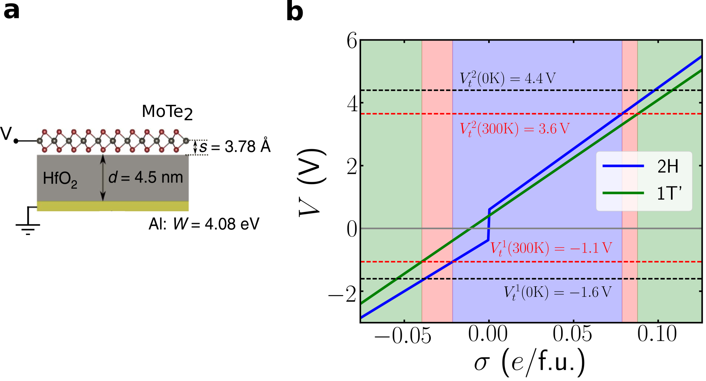

# Figure 1

This figure relies on the zero-temperature voltage-excess charge
values in the `data` folder. In addition, it uses the T=300K
transition voltages computed in Figure 4.

To run, do the following:

``` bash
$ python fig1.py
```

and this will save `fig1b.png`.  The diagram shown in (a) is done in
Inkscape (see the `fig1.svg` file).



