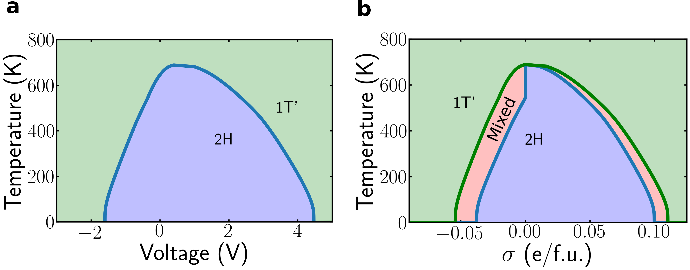

# Figure 4

This folder uses both the Voltage-excess charge data from Figure 1 and
the entropy data from SI Figure 2. The full phase diagram is shown
here.

<p align="center"></p>

To generate this figure, run the following

``` bash
$ python fig4.py
```

which produces `fig4.png`.


## Details on calculation
The `fig4.py` file provides comments on the different steps of the
computation. The details are also described in the Supplementary
information for the paper. Here, we provide a few extra figures to
show the different steps of generating the phase diagram. 

The phase diagram comes from the Clausius-Clapeyron relation


The entropy difference ∆S depends on both the charge Q and temperature T. The supplementary information of the paper contains numerous details on the calculation.