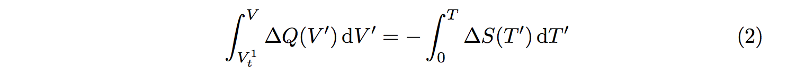
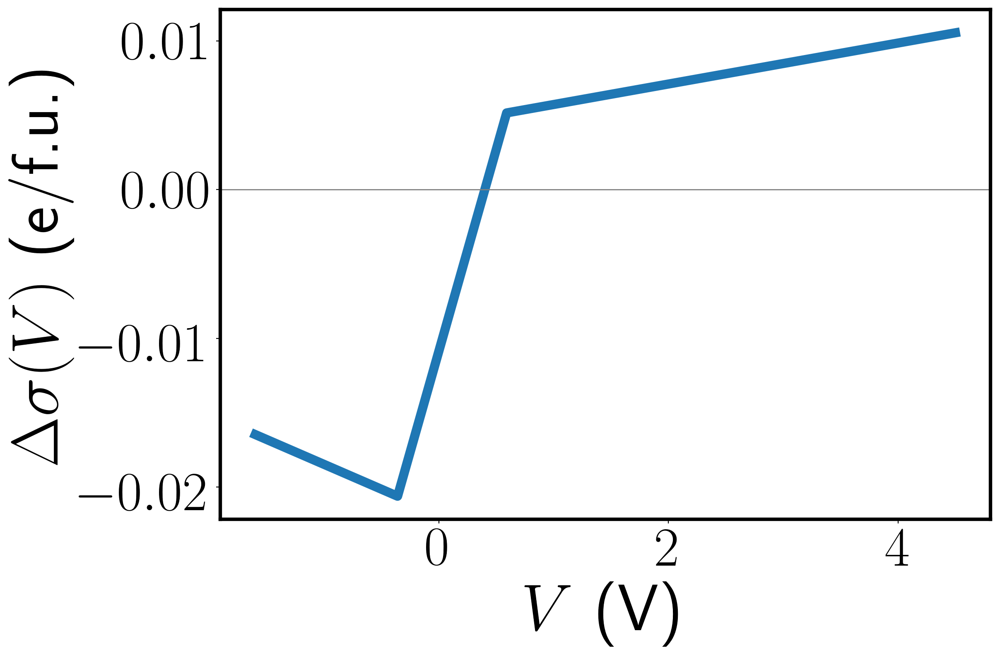

# Figure 4

This folder uses both the Voltage-excess charge data from Figure 1 and
the entropy data from SI Figure 2. The full phase diagram is shown
here.

<p align="center"></p>

To generate this figure, run the following

``` bash
$ python fig4.py
```

which produces `fig4.png`.


## Details on calculation
The `fig4.py` file provides comments on the different steps of the
computation. The details are also described in the Supplementary
information for the paper. Here, we provide a few extra figures to
show the different steps of generating the phase diagram. 

The phase diagram comes from the Clausius-Clapeyron relation


Rearranging and integrating both sides leads to 




Here, we discuss the right side of Equation 2 first, followed by the
left side. The right side is a simple integral of the entropy
difference calculated in SI Figure 2.  That integral results in the
following as a function of temperature T


<p align="center"></p>

The left-hand side requires integrating \Delta Q, which looks as follows

<p align="center"></p>

The integral starting at the negative zero-temperature transition
voltage looks as follows

<p align="center"></p>

The next step is to try to match values between the integral
plots. This ends up resulting in a function that qualitiatively looks
right, but has 'steps' in it, due to the finite number of values in
the entropy data, which comes in intervals of 10 K. This step behavior
is shown below

<p align="center"></p>

After generating these values, we use a smoothing routine to compute a
more accurate phase transition curve.
