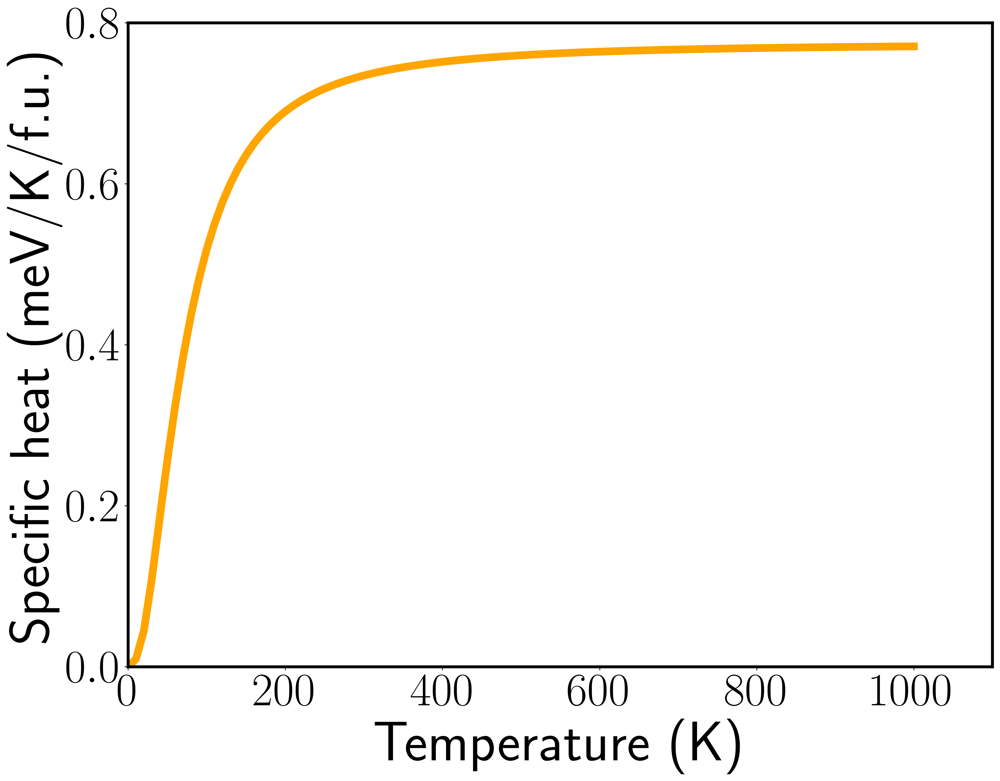

# SI Figure 5

This figure relies on the data in

`data/thermal_properties/phonon/2H`.

Note that the electronic contribution to the heat capacity for the 2H
phase (plotted here) is negligible in comparison to the phonon entropy.

To generate this figure, run

``` bash
$ python sifig5.py
```



